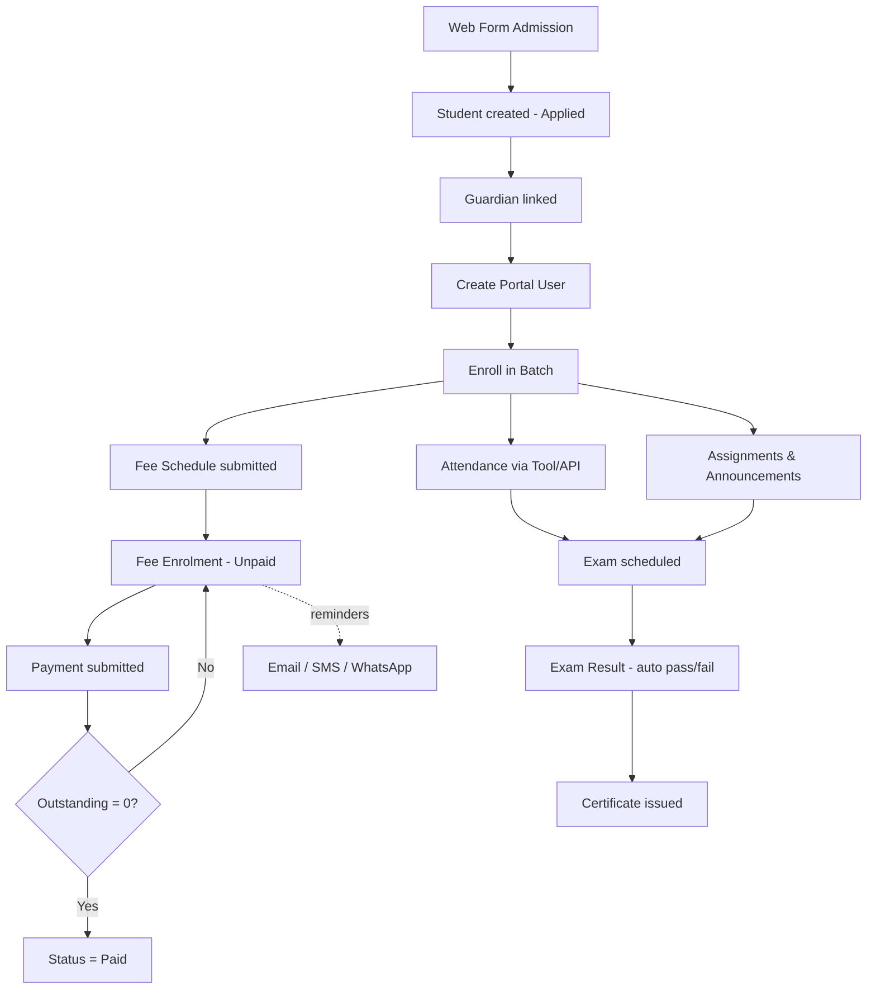

# Tuition Center — Frappe Framework v15+ App

A complete, advanced **Tuition / Coaching Centre Management System** built for the **Frappe Framework v15+** (works standalone on plain Frappe; ERPNext not required).

> App name (Python module): `tution_center` · Repo: `tution-Center` · License: MIT

---

## 📑 Table of Contents

1. [Feature Highlights](#-feature-highlights)
2. [System Overview & Architecture](#-system-overview--architecture)
3. **[Standard Operating Procedure (SOP) — Functional Flow](#-standard-operating-procedure-sop)** ← read this to understand the process
4. [End-to-End Lifecycle Diagram](#-end-to-end-lifecycle-diagram)
5. [Automation & Scheduled Jobs](#-automation--scheduled-jobs)
6. [Reports, Dashboards & Portal](#-reports-dashboards--portal)
7. [REST / Whitelisted API Reference](#-rest--whitelisted-api-reference)
8. [Installation](#-installation)
9. [Roles & Permissions Matrix](#-roles--permissions-matrix)
10. [Doctype Reference](#-doctype-reference)
11. [Mobile App (PWA) — like Frappe HRMS](#-mobile-app-pwa--like-frappe-hrms)
12. [Future Scope / Roadmap](#-future-scope--roadmap)

---

## ✨ Feature Highlights

### Academics
- **Course** catalogue with levels, fees, assessment weightage validation and per-course student counters
- **Batch / Class Group** with schedule, room, teacher, seat capacity & live fill-rate, date validation
- **Academic Term** (terms/semesters) and **Assessment Structure** per course
- **Room / Location** registry to avoid double booking

### People
- **Student** profiles with photo, guardians, live counters (`total_batches`, `total_fees_due`) and one-click **portal user** creation
- **Guardian** linked to students with relationship & contact info
- **Teacher / Instructor** profiles linked to Frappe users & employees, with auto user creation

### Fees & Payments
- **Fee Structure** builder (components + discounts + taxes → net amount)
- **Fee Schedule** bulk generation per batch/term — pulls active batch students and creates **Fee Enrolments** on submit (duplicate-safe)
- **Fee Enrolment** ledger per student tracking fee/paid/outstanding with auto status (`Unpaid → Partially Paid → Paid`)
- **Payments** with **part-payment support**, payment modes, reference numbers, overpayment warning, auto student-status sync, cancel-safe recalculation
- **Invoice Print Format** & receipt PDF ready

### Attendance
- **Attendance Tool**: mark daily attendance for a whole batch in one screen
- **Student Attendance** per student/date/batch with duplicate prevention
- Bulk marking API for integrations

### Exams & Results
- **Exam** scheduling per batch/course with invigilator, room, date validation and result locking
- **Exam Result** entry with auto pass/fail and per-exam student counters
- **Assessment Criteria** / grading scales

### Learning & Operations
- **Announcements** (audience, expiring, pinned, email broadcast on submit)
- **Assignments** with due dates, status tracking and submissions
- **Timetable** per batch with clash detection + read-only **Timetable Portal** page
- **Library** (books & issues with availability tracking), **Certificates** (auto default content), **Complaints** (SLA due dates, escalation, auto-notification)

### Messaging & Automation
- **SMS console** (`send_sms_to_students`) via Frappe SMS settings
- Scheduled **daily fee reminders** + manual per-enrolment reminder button
- **Weekly digest** email to all Tuition Managers (new students, payments, open complaints)
- **WhatsApp-ready** deep links per student

### Portal & UX
- Student/Guardian **Web Portal** (server-rendered page): fees, outstanding, announcements, timetable
- **Web Form** for online admissions (`/tuition-admission`)
- Frappe v15-native **Workspace** with number cards & dashboard charts
- Full REST API via Frappe + dedicated whitelisted endpoints

---

## 🏗 System Overview & Architecture

```
tution_center/
├── academics        Course · Batch · Academic Term · Room · Timetable
├── people           Student · Guardian · Teacher
├── fees             Fee Structure · Fee Schedule · Fee Enrolment · Payment
├── assessment       Assessment Structure · Criterion · Exam · Exam Result
├── attendance       Attendance Tool · Student Attendance
├── engagement       Announcement · Assignment · Book · Book Issue
├── service          Certificate · Complaint · Notification Reminder
└── settings         Tuition Settings (single)
```

**Design principles**

| Principle | How it is implemented |
|---|---|
| Single source of truth | Money only lives on **Fee Enrolment**; Payments are immutable submitted docs that *recompute* the ledger (`update_paid_amount`) — never manually edited |
| Duplicate safety | Fee Schedule skips existing enrolments; Attendance API updates instead of re-inserting |
| Status is derived | Fee Enrolment status & student `total_fees_due` are always recalculated, never typed in |
| Permission-first | `permissions.py` filters list views (teachers → their batches) and doc-level checks (students → own data) |
| Portal-native | Same data served to desk and portal via whitelisted APIs |

---

## 📘 Standard Operating Procedure (SOP)

This section explains **the exact operating process** the app implements, step by step, in the order a tuition centre would use it day to day. Each step names the doctype, who does it, and what the system does automatically (⚙️).

### Phase 0 — One-time Setup (Tuition Manager)

| # | Step | Doctype | Notes |
|---|------|---------|-------|
| 0.1 | Configure centre defaults | **Tuition Settings** | Default currency, SMS/reminder toggles, centre name for templates |
| 0.2 | Create roles assignment | User → Roles | Assign `Tuition Manager`, `Tuition Teacher`, `Student`, `Guardian` |
| 0.3 | Register physical rooms | **Room** | Capacity per room; used for clash-free scheduling |

### Phase 1 — Academic Catalogue (Tuition Manager)

1. **Create Course** (`Course`)
   - Set course name, level, duration, fee, and optional **Assessments** child rows (name + weightage).
   - ⚙️ If assessment weightages are entered, they must total **100** (warns otherwise).
2. **Create Academic Term** (`Academic Term`) — term name, start/end dates. ⚙️ End date must be after start date.
3. **Create Assessment Structure** per course if you use graded criteria (`Assessment Structure` + `Assessment Criterion` rows with max marks / weightage).

### Phase 2 — People & Admissions

**Flow: Enquiry → Student → Guardian → Portal User → Batch Enrolment**

1. **Online admission (optional)** — applicant fills the public web form `/tuition-admission`
   - ⚙️ Creates a **Student** in `Applied` status for back-office review.
2. **Register Student** (`Student`)
   - Fill name, DOB, email, mobile, joining date. ⚙️ Joining date defaults to today.
   - Attach one or more **Guardians** (child table) with relationship and contact.
3. **Create Guardian records** (`Guardian`) — each Guardian also carries a *Guardian Student* child table, so the link is visible from both sides.
4. **Create portal login** — on the Student form click **Create Portal User**
   - ⚙️ Creates a `Website User` with roles `Student` + `Guardian`, links it back to the student. If a user with that email already exists it is reused, not duplicated.
5. **Enrol into Batch** — on the Student form click **Enroll in Batch** (or use the Batch form)
   - ⚙️ Validates **seat capacity** (throws when the batch is full) and appends an active `Batch Student` row; course/batch counters update live.

### Phase 3 — Teacher & Room Readiness (Tuition Manager)

1. **Create Teacher** (`Teacher`) — link a Frappe user (⚙️ auto-creates one if absent) and optionally an Employee.
2. **Build Timetable** (`Batch → Timetable Slots`)
   - Add weekly slots: day, start/end time, course, teacher, room.
   - ⚙️ **Clash detection**: a slot is rejected if the room, teacher, or batch is already booked in that overlap.

### Phase 4 — Fees & Payments (money flow) 💰

**Flow: Fee Structure → Fee Schedule → Fee Enrolment → Payment → Status sync → Reminders**

```
Fee Structure (template)          Fee Schedule (batch run)           Fee Enrolment (per student)
┌────────────────────────┐  pick  ┌──────────────────────┐  submit  ┌────────────────────────────┐
│ components + discounts │──────▶ │ pull batch students  │─────────▶│ 1 row per student          │
│ + taxes  → net_amount  │        │ ⚙ totals auto-calc   │  ⚙ auto  │ fee / paid / outstanding   │
└────────────────────────┘        └──────────────────────┘          │ status auto-derived        │
                                                                    └────────────┬───────────────┘
                                                       Payment(s) submitted      │
                                                       ──────────────────────────┘
                                                       ⚙ recomputes paid & outstanding,
                                                         updates status, refreshes student dues
```

1. **Define Fee Structure** (`Fee Structure`)
   - Add **Fee Components** (tuition, materials, exam fee…), discounts and tax %.
   - ⚙️ `net_amount` is computed from components − discount + tax. This is the amount every student will be billed.
2. **Create Fee Schedule** (`Fee Schedule`) — select Course, **Batch**, Fee Structure, Academic Term and due date.
   - Click **Get Students from Batch** → ⚙️ pulls all *active* batch students and stamps each row with the structure's `net_amount`; totals are recalculated automatically.
   - **Submit** the schedule.
   - ⚙️ **On submit**, one **Fee Enrolment** is created per student with status `Unpaid` and the schedule's due date. Students who already have an enrolment for the *same structure + term* are skipped (no double billing).
3. **Collect Payments** (`Payment`)
   - Create a Payment linked to the **Fee Enrolment**; enter amount, mode, reference.
   - ⚙️ Validates amount > 0; auto-fills the student from the enrolment; warns (does not block) if the amount exceeds outstanding; auto-stamps `received_by`.
   - **Submit** the payment.
   - ⚙️ Recomputation cascade: Payment submit/cancel → `update_paid_amount()` on the enrolment (sums *submitted* payments only) → status becomes `Paid` / `Partially Paid` / `Unpaid` → student's `total_fees_due` refreshed.
   - **Part payments are first-class**: collect any amount, any number of times.
   - Shortcut: **Record Payment** button / API `make_payment_for_enrolment` creates + submits the payment in one step.
4. **Reminders**
   - Manual: **Send Reminder** button on a Fee Enrolment (or API `send_fee_reminder`) → email with formatted outstanding amount.
   - Automatic: daily scheduled job emails every `Unpaid` / `Partially Paid` enrolment (toggle in Tuition Settings).

### Phase 5 — Daily Attendance 🗓

**Option A — Attendance Tool (recommended for teachers)**
1. Open **Attendance Tool**, pick date + batch → ⚙️ student list loads via `get_batch_students`.
2. Mark each student Present / Absent / Leave and **Submit**.
3. ⚙️ Bulk-creates **Student Attendance** records on submit; re-running for the same student/date/batch **updates** the existing record instead of duplicating.

**Option B — API** — call `mark_attendance(students, date, batch, status_map)` with `{"Absent": [...], "Leave": [...]}` (everyone else defaults to Present). Permission-checked (`Student Attendance` create).

### Phase 6 — Teaching Operations 📚

1. **Announcements** — create with audience (Students / Teachers / All), publish & expiry dates, pin flag.
   - ⚙️ On submit, an email broadcast is sent to the selected audience. Portal shows only published, non-expired, pinned-first items.
2. **Assignments** — teacher creates an Assignment for a batch/course with due date; submissions are tracked in the **Assignment Submission** child/linked records with status and marks.
3. **Timetable portal** — students/teachers open **Tuition Portal** and see the read-only weekly timetable of their batch (`get_student_timetable`).

### Phase 7 — Exams & Results 📝

1. **Schedule Exam** (`Exam`) — batch, course, date, room, invigilator, max marks.
   - ⚙️ Validates the exam date falls within the batch dates; room/invigilator visible for clash review.
2. **Enter Results** (`Exam Result`) — one row per student with marks.
   - ⚙️ Auto pass/fail against the exam's pass marks; exam's result counter updates.
   - ⚙️ Once results are recorded and submitted, the **Exam locks** (result editing is blocked — see `validate_results`).

### Phase 8 — Library, Certificates & Service Desk

1. **Library** — register **Books** (⚙️ availability tracked from issues). Issue via **Book Issue**: ⚙️ validates the copy is available; on return the availability is restored.
2. **Certificates** — pick student + course → ⚙️ issue date defaults to today and **default certificate text** is generated; print via the certificate print format.
3. **Complaints (service desk)**
   - Raise complaint → ⚙️ `raised_by` = current user, `date_raised` = today, **SLA due date** auto-set (1 day for High/Critical, 3 days otherwise).
   - Resolve/Close → ⚙️ `resolved_on` timestamped and the complainant is **emailed automatically**.
   - Escalate (button/API) → ⚙️ priority bumped one level (Low → Medium → High → Critical) and status set to `Reopened`.

### Phase 9 — Communication Console 📣

- **SMS**: select students → `send_sms_to_students(students, message)` → ⚙️ mobile numbers pulled per student and sent through Frappe SMS Settings.
- **WhatsApp**: ⚙️ wa.me deep links generated per student for one-tap chats (works with WhatsApp Web/Desktop).
- **Weekly digest**: every week all **Tuition Managers** receive new-students / payments / open-complaints counts.

### Phase 10 — Portal Usage (Student / Guardian)

| What they see | Source |
|---|---|
| Their fee ledger + outstanding | `get_portal_fees` (resolves user → student, or guardian → children) |
| Announcements | `get_announcements` (published, non-expired, pinned first) |
| Weekly timetable | `get_student_timetable` |
| Dashboard counts | `get_student_dashboard_data` |
| Online admission form | Web Form `/tuition-admission` |

Guardians automatically see **all linked children** — no configuration needed beyond the Guardian↔Student link.

---

## 🔁 End-to-End Lifecycle Diagram



---

## ⚙️ Automation & Scheduled Jobs

| Automation | Trigger | Effect |
|---|---|---|
| Fee Enrolment creation | Fee Schedule **submit** | One ledger row per active batch student, duplicate-safe |
| Ledger recompute | Payment **submit / cancel** | paid, outstanding, status, student dues all recalculated |
| Status derivation | Fee Enrolment validate | Unpaid / Partially Paid / Paid never manually set |
| Duplicate attendance guard | Attendance save/API | Updates existing record for same student+date+batch |
| Timetable clash guard | Timetable Slot save | Rejects room/teacher/batch overlap |
| Exam lock | Result recorded | Result editing blocked after submission |
| Complaint SLA | Complaint save | Due date = +1 day (High/Critical) or +3 days |
| Complaint notify | Status → Resolved/Closed | Auto email to complainant |
| Announcement broadcast | Announcement submit | Email to selected audience |
| **Daily fee reminders** | Scheduler (daily) | Emails all Unpaid / Partially Paid enrolments |
| **Weekly digest** | Scheduler (weekly) | Stats email to all Tuition Managers |

---

## 📊 Reports, Dashboards & Portal

**Workspace — Tuition Center** with number cards & charts:
- Number cards: Total Active Students · Active Batches · Outstanding Fees · Open Complaints
- Charts: Monthly Collections · Students by Status

**Script Reports**
- **Outstanding Fees Report** — who owes what, per course/term, sortable by ageing
- **Student-wise Fee Collection** — collections per student with payment drill-down

**Portal** — server-rendered **Tuition Portal** page for students/guardians (fees, announcements, timetable) + **web form** for admissions.

---

## 🔌 REST / Whitelisted API Reference

All endpoints are `POST`/`GET` callable at `/api/method/tution_center.api.<fn>` (or from `frappe.call` in client scripts). Permission checks are built into each.

| Endpoint | Purpose |
|---|---|
| `get_batch_students(batch)` | Roster for Attendance Tool |
| `mark_attendance(students, date, batch, status_map)` | Bulk attendance marking |
| `send_fee_reminder(fee_enrolment)` | Immediate reminder for one enrolment |
| `send_sms_to_students(students, message)` | Bulk SMS via Frappe SMS |
| `make_payment_for_enrolment(fee_enrolment, amount, mode, ref)` | One-step payment create+submit |
| `get_student_timetable(batch, date)` | Weekly slots for a batch |
| `get_portal_fees()` | Caller's (or children's) fee ledger |
| `get_student_dashboard_data()` | Portal homepage counts |
| `get_announcements()` | Active announcements |
| `Student.create_portal_user()` | Portal account for a student |
| `Student.enroll_in_batch(batch)` | Enrol student into batch |
| `Complaint.escalate()` | Bump priority + reopen |

Standard Frappe REST (`/api/resource/...`) works for every doctype subject to the role matrix below.

---

## 💻 Installation (bench)

```bash
cd $PATH_TO_BENCH
bench get-app https://github.com/joshent31/tution-Center.git
bench --site yoursite.local install-app tution_center
bench --site yoursite.local migrate
bench build --app tution_center
bench restart
```

> ⚠️ App name is `tution_center` (Python module name), repo name is `tution-Center`.

**Post-install checklist:** set currency & toggles in **Tuition Settings** → create Rooms → Courses → Academic Terms → Fee Structure → assign roles to users.

---

## 🛡 Roles & Permissions Matrix

| Role | Desk Access | Portal Access |
|------|--------|--------|
| **Tuition Manager** | Full CRUD on all doctypes + settings | — |
| **Tuition Teacher** | Read/create attendance, exams, assignments, announcements, results; batches filtered to *their own* (permission query) | Timetable, announcements |
| **Student** | Own records only (`has_permission` doc check) | Own fees, results, timetable, announcements |
| **Guardian** | — | All linked children's fees, announcements, timetable |

Enforced via `permissions.py` (`get_permission_query_conditions` for list views + `has_permission` for document level), so students can never list each other's fee data.

---

## 📂 Doctype Reference

| Group | Doctypes |
|---|---|
| Academics | Course (+ Course Assessment) · Batch (+ Batch Student, Timetable Slot) · Academic Term · Room · Timetable |
| People | Student (+ Student Guardian) · Guardian (+ Guardian Student) · Teacher |
| Fees | Fee Structure (+ Fee Component) · Fee Schedule (+ Fee Schedule Student) · Fee Enrolment (+ Fee Payment Reference) · Payment |
| Assessment | Assessment Structure · Assessment Criterion · Exam (+ Exam Result Student) · Exam Result |
| Attendance | Attendance Tool (+ child) · Student Attendance |
| Engagement | Announcement · Assignment (+ Assignment Submission) · Book · Book Issue |
| Service | Certificate · Complaint · Notification Reminder |
| Settings | Tuition Settings (Single) |

---

## 📱 Mobile App (PWA) — like Frappe HRMS

Just like **Frappe HRMS** ships its mobile experience as an installable **PWA served from the app itself**, this app serves a full mobile app at **`/mobile`** on your site — no separate server, no extra hosting. Users open the URL once, log in, and **"Add to Home Screen"**; from then on it behaves like a native app (own icon, full-screen, splash, offline shell). For Play Store / App Store distribution, wrap the same app with **Capacitor** (guide below).

### What users get

| Role | In the app |
|---|---|
| **Student** | Outstanding-fee hero card · today's classes · batches & grade · full fee ledger with per-course progress bars & payment history · weekly timetable · exam results (pass/fail, avg %, grade) · 90-day attendance % · assignments with submission status · announcements · raise complaints · own profile |
| **Guardian** | Everything above for **each linked child**, with a one-tap child switcher |
| **Teacher** | Batch dashboard (students, seats filled) · today's classes with room · batch rosters · mark attendance from the phone (bulk Present/Absent/Leave) |

### How users install it (SOP)

1. Centre shares the link: `https://your-site.com/mobile` (via WhatsApp, SMS or email).
2. User opens it and signs in with the account the centre created for them (*Create Portal User*).
3. Install:
   - **Android (Chrome)**: menu ⋮ → **Add to Home screen** → confirm. Icon appears like a normal app.
   - **iPhone (Safari)**: Share → **Add to Home Screen**.
   - **Desktop**: install icon in the address bar.
4. Opening the icon launches full-screen with the app logo — login persists (session cookie), and the last-viewed shell renders instantly even before data arrives.

> Website users are sent straight to the app after login (`website_user_home_page` hook), so the website homepage is never in their way.

### Technical design

| Piece | File | Purpose |
|---|---|---|
| Page shell | `tution_center/www/mobile.{py,html,json}` | Server-renders session state (logged-in, roles, CSRF) into the HTML |
| SPA | `public/js/mobile_app.js` | Vanilla-JS app: login screen, 5 tabs (Home / Fees / Timetable / Results / More), child switcher, install prompt |
| Styles | `public/css/mobile.css` | App-shell layout, safe-area insets, skeleton loaders |
| API | `tution_center/mobile_api.py` | Whitelisted, **scoped** endpoints (`get_me`, `get_fees`, `get_timetable`, `get_results`, `get_attendance`, `get_assignments`, `create_complaint`, teacher `mark_attendance` …) — every query is filtered by the caller's student/guardian/teacher links |
| Manifest | `public/images/manifest.json` | Name, icons, theme colour, shortcuts (Fees / Timetable / Results) |
| Service worker | `public/js/tuition_sw.js` | Offline app shell; **never** caches API responses |
| Icons | `public/images/icon-*.png` | 192 / 512 / maskable variants |

After install/migrate + `bench build --app tution_center`, visit `https://your-site.com/mobile`.

### Publishing to Play Store / App Store (Capacitor wrapper)

The same PWA can be wrapped into a store binary — this is exactly how HRMS-style PWAs go to stores:

```bash
npm init -y && npm i @capacitor/core @capacitor/cli
npx cap init "Josh Tuition" com.joshent.tuition --web-dir=www
# point the app at your site
#   capacitor.config.json -> { "server": { "url": "https://your-site.com", "cleartext": false } }
npm i @capacitor/android @capacitor/ios
npx cap add android && npx cap add ios
npx cap sync
npx cap open android   # build & sign AAB in Android Studio
npx cap open ios       # build & sign in Xcode
```

Because the wrapper loads your live site, features, fixes and branding ship **without store re-reviews**; the native shell adds push-notification and camera capabilities for the roadmap below.

---

Planned enhancements, grouped by module. Items marked *(easy)* are small increments on the current design; *(major)* are new subsystems.

### 💳 Payments & Finance
- **Online payment gateway** (Razorpay / Stripe / PayPal) — pay from portal, auto-create submitted Payment on webhook *(easy — Payment model already supports references)*
- **Gateway reconciliation report** — match bank settlements to Payment reference numbers
- **Refunds & credit notes** — negative payments with approval workflow
- **Discount & scholarship engine** — percentage/fixed concessions per student with approval trail
- **GST / tax invoice compliance** & TDS-ready exports
- **Expense & payroll module** — teacher salaries, centre rent, P&L per centre/branch
- **Multi-currency** fee structures for international students

### 🎓 Academics
- **Auto timetable generator** — constraint solver from slots + rooms + teachers *(major)*
- **Biometric / QR / RFID attendance** capture feeding `mark_attendance`
- **Parent-teacher meeting scheduler** with slot booking
- **Learning content (LMS-lite)** — recordings, notes, YouTube/Drive embedding per course
- **Live online classes** — Zoom/Google Meet links auto-attached to Timetable Slots
- **Homework auto-grading & plagiarism check**
- **Report card generator** — term-wise, from Assessment Structure + Exam Results, PDF with graphs
- **Adaptive tests / question bank** with OMR support

### 📣 Communication
- **WhatsApp Cloud API integration** — templated fee reminders, absence alerts, result notifications (currently wa.me deep links) *(easy)*
- **Push notifications (FCM)** — `register_push_token` endpoint already exists in `mobile_api.py`; wire an FCM sender + send on fee reminders / absence / results *(easy)*
- **Absence auto-alert** — instant guardian email/SMS/push when attendance marked Absent *(easy — hook on Student Attendance)*
- **Two-way messaging inbox** with threading per student

### 🏢 Multi-centre & Scaling
- **Multi-branch support** — company/branch dimension on all masters, consolidated + per-branch dashboards *(major)*
- **Franchise mode** — separate ledgers, royalty calc, per-branch fee structures
- **Lead CRM pipeline** — enquiry → follow-ups → conversion with WhatsApp follow-ups
- **Frappe CRM / Campaign integration** for marketing funnels

### 📈 Analytics & AI
- **At-risk student early warning** — attendance % + fee delinquency + falling marks composite score *(easy — data already captured)*
- **Attendance & performance trend charts** per student in portal
- **AI assistant** — "which batch is underperforming", fee forecast, auto-drafted announcements
- **Forecasting** — cash-flow projection from fee schedules

### 🔐 Platform & Compliance
- **Digital signature / QR verification** on certificates (anti-forgery) *(easy)*
- **Data retention & GDPR export/erase** for student PII
- **SSO** (Google/Microsoft) for portal users
- **Audit trail page** — who changed fees/results, when (beyond Frappe versions)
- **Mobile-first PWA for attendance on the go** ✅ *done — see Mobile App section above; remaining: offline attendance queue sync*

> Want to contribute a roadmap item? Open an issue or a PR — the module structure above shows exactly where each feature belongs.

---

## 📄 License

MIT — see `license.txt`.
